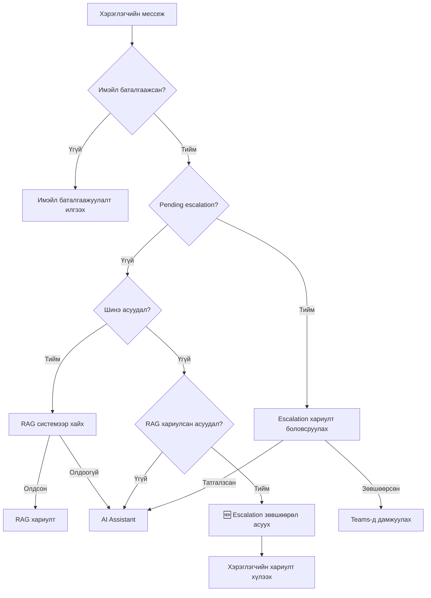

# 📧 Имэйл баталгаажуулалттай Chatwoot Chatbot

Энэ систем нь хэрэглэгчдээс эхлээд имэйл хаягаа баталгаажуулахыг шаардаж, дараа нь OpenAI Assistant-той харилцах боломжийг олгодог.

## 🚀 Системийн ажиллагаа

1. **Хэрэглэгч Chatwoot chatbot-д мессеж бичнэ**
2. **Система имэйл хаяг шаардана**
3. **Хэрэглэгч имэйлээ оруулна**
4. **Система тухайн имэйл рүү баталгаажуулах линк илгээнэ**
5. **Хэрэглэгч линк дээр дарж баталгаажуулна**
6. **Баталгаажуулсны дараа chatbot ажиллаж эхэлнэ**

## 📋 Шаардлагатай зүйлс

### Python packages

```bash
pip install -r requirements.txt
```

### Орчны хувьсагчид

`env_example.txt` файлыг `.env` болгон хуулж, дараах мэдээллийг оруулна уу:

- **OpenAI**: API key болон Assistant ID
- **Chatwoot**: API key болон Account ID
- **Gmail**: Имэйл болон App Password
- **JWT Secret**: Аюулгүй түлхүүр үг
- **Verification URL**: Таны сервэрийн хаяг

### Gmail тохиргоо

1. Gmail дээр 2-Factor Authentication идэвхжүүлэх
2. App Password үүсгэх
3. `SENDER_EMAIL` болон `SENDER_PASSWORD` тохируулах

## 🔧 Суулгах заавар

```bash
# 1. Repository клон хийх
git clone <your-repo>
cd <your-repo>

# 2. Dependencies суулгах
pip install -r requirements.txt

# 3. Environment variables тохируулах
cp env_example.txt .env
# .env файлыг засварлаж өөрийн мэдээллээр дүүргэх

# 4. Серверийг ажиллуулах
python main.py
```

## 📡 Webhook тохиргоо

Chatwoot дээр webhook URL тохируулах:

```
http://your-domain.com/webhook
```

## 🎯 Ашиглах заавар

### Хэрэглэгчийн хувьд:

1. Chatwoot chatbot-д дурын мессеж бичих
2. "Зөв имэйл хаягаа бичээд илгээнэ үү" гэх мессеж ирнэ
3. Имэйл хаягаа бичих (жишээ: `user@gmail.com`)
4. "Имэйл рүү баталгаажуулах линк илгээлээ" гэх мессеж ирнэ
5. Имэйлээ шалгаад линк дээр дарах
6. "Амжилттай баталгаажлаа" хуудас харагдана
7. Chatwoot дээр "Таны имэйл баталгаажлаа!" мессеж ирнэ
8. Одоо chatbot-той чатлаж болно

### Техникийн дэлгэрэнгүй:

- Хэрэглэгч бүр өөрийн OpenAI thread-тэй
- Имэйл баталгаажуулах токен 24 цагийн дараа дуусна
- Chatwoot conversation дээр `email_verified` болон `verified_contact_{contact_id}` хадгалагдана

## 🔒 Аюулгүй байдал

- JWT токен ашиглан имэйл баталгаажуулах
- Токен 24 цагийн дараа автоматаар дуусна
- Хэрэглэгч тус бүрийн thread тусгаарлагдмал
- Имэйл format шалгагддаг

## 🐛 Алдаа засварлах

Хэрэв асуудал гарвал:

1. Console логуудыг шалгах
2. Environment variables зөв тохируулсан эсэхийг шалгах
3. Gmail App Password зөв ашиглаж байгаа эсэхийг шалгах
4. Chatwoot webhook URL зөв тохируулсан эсэхийг шалгах

## 📞 Дэмжлэг

Асуулт байвал issue үүсгэнэ үү.

# Chatwoot AI Chatbot + RAG Документ Систем

## Ерөнхий тойм

Энэ систем нь **Chatwoot** платформд зориулсан **AI chatbot** бөгөөд **RAG (Retrieval-Augmented Generation)** технологи ашиглан документын хайлтыг интеграци хийсэн юм. Систем нь хэрэглэгчийн асуултыг автоматаар хариулж, шаардлагатай үед ажилтанд дамжуулдаг.

## Гол онцлогууд

### 🤖 AI Chatbot

- **OpenAI Assistant API** ашиглан хэрэглэгчтэй автомат харилцах
- Имэйл баталгаажуулалт шаардах
- Microsoft Teams-ээр ажилтанд мэдээлэх
- Retry механизм болон алдаа удирдлага

### 📚 RAG Документ Систем

- **LangChain + FAISS** ашиглан векторын хайлт
- Документ сайтаас автомат мэдээлэл цуглуулах
- Хэрэглэгчийн асуултыг документаас хайж хариулах
- Source links-тэй хариулт өгөх

### 🔗 Интеграци онцлогууд

- Документын асуулт бол RAG систем ашиглах
- Ерөнхий асуулт бол AI Assistant ашиглах
- Автомат система сонголт
- Teams мэдээлэл зөвхөн AI Assistant-д

## API Endpoints

### Үндсэн endpoints

- `POST /webhook` - Chatwoot webhook handler
- `GET /verify` - Имэйл баталгаажуулалт
- `GET /health` - Системийн health check

### RAG системийн endpoints

- `POST /docs-search` - Документ хайлтын тусдаа API
- `POST /rebuild-docs` - Документын vector store дахин бүтээх

### Тест endpoints

- `GET /test-teams` - Teams мэдээлэл тест

## Суулгах заавар

### 1. Dependencies суулгах

```bash
pip install -r requirements.txt
```

### 2. Орчны хувьсагчид тохируулах

```bash
# OpenAI тохиргоо
OPENAI_API_KEY=sk-...
ASSISTANT_ID=asst_...

# Chatwoot тохиргоо
CHATWOOT_API_KEY=your_chatwoot_token
ACCOUNT_ID=1

# Email тохиргоо
SENDER_EMAIL=your-email@gmail.com
SENDER_PASSWORD=your-app-password
SMTP_SERVER=smtp.gmail.com
SMTP_PORT=587

# Teams тохиргоо (сонголт)
TEAMS_WEBHOOK_URL=https://...

# RAG тохиргоо
DOCS_BASE_URL=https://docs.cloud.mn

# JWT тохиргоо
JWT_SECRET=your-secret-key
VERIFICATION_URL_BASE=http://localhost:5000
```

### 3. Ажиллуулах

```bash
python main.py
```

## Системийн ажиллагаа

### 1. Хэрэглэгчийн асуулт ирэх

```
Webhook → Баталгаажуулалт шалгах → Асуултын төрөл тодорхойлох
```

### 2. Документын асуулт

```
RAG систем → Документ хайх → Хариулт + Sources → Chatwoot
```

### 3. Ерөнхий асуулт

```
AI Assistant → OpenAI API → Хариулт → Teams мэдээлэл → Chatwoot
```

## RAG Системийн бүтэц

### Документ цуглуулалт

- BeautifulSoup ашиглан web scraping
- Автомат link дагаж цуглуулах
- Title болон content тусгаарлах

### Vector Store

- LangChain RecursiveCharacterTextSplitter
- OpenAI Embeddings
- FAISS векторын сан
- Дискэнд хадгалагдах

### Хайлтын механизм

- Similarity search
- Top 3 документ олох
- Source metadata хадгалах

## Teams интеграци

### Мэдээллийн дүрүүд

- 📋 Хэрэглэгчийн асуудлын дүгнэлт
- 🤖 AI систем алдаа
- 🔄 Retry бүтэлгүйтэх
- 📊 Асуудлын статистик

### Adaptive Cards формат

- Тодорхой мэдээлэл
- Chatwoot руу шилжих товч
- Цаг хугацааны тэмдэг

## Хэрэглээний жишээ

### Документын асуулт

```
Хэрэглэгч: "API хэрхэн ашиглах вэ?"
→ RAG систем ажиллана
→ Документаас хайж олно
→ Хариулт + docs.cloud.mn links
```

### Ерөнхий асуулт

```
Хэрэглэгч: "Сайн байна уу? Тусламж хэрэгтэй байна"
→ AI Assistant ажиллана
→ OpenAI хариулт
→ Teams мэдээлэл илгээх
```

## Монитинг

### Health Check

```bash
curl http://localhost:5000/health
```

### RAG тест

```bash
curl -X POST http://localhost:5000/docs-search \
  -H "Content-Type: application/json" \
  -d '{"question": "API documentation"}'
```

### Teams тест

```bash
curl http://localhost:5000/test-teams
```

## Системийн архитектур

```
Chatwoot → Flask Webhook → Email Check → Question Type
                                             ↓
                              ┌─ RAG System (docs questions)
                              └─ AI Assistant (general questions)
                                             ↓
                              Response → Teams (if needed) → Chatwoot
```

## Анхаарах зүйлс

1. **Vector Store** эхний удаа бүтээхэд удаан болно
2. **OpenAI rate limits** анхаарах
3. **Teams webhook** сонгогдсон тохиргоо
4. **Email SMTP** зөв тохируулах шаардлагатай
5. **DOCS_BASE_URL** документын сайт байх ёстой

## Хөгжүүлэлт

Системийг хөгжүүлэхийн тулд:

- Шинэ документын сайт нэмэх
- RAG prompt сайжруулах
- Teams notification форматыг өөрчлөх
- Monitoring нэмэх

---

**Анхаарах:** Энэ систем production орчинд ашиглахын өмнө бүх тохиргоог сайтар шалгана уу.

# Chatwoot AI Chatbot with Smart Topic Tracking

Энэ бол Chatwoot-той холбогдсон ухаалаг AI chatbot систем юм. Тус систем нь хэрэглэгчийн асуудлыг ухаалаг байдлаар tracking хийж, RAG системээр хариулдаг.

## 🎯 Үндсэн онцлогууд

### 📚 RAG (Retrieval-Augmented Generation) Систем

- Документ сайтаас автомат мэдээлэл цуглуулах
- Vector store-оор хурдан хайлт хийх
- Холбогдох эх сурвалжтай хариулт өгөх

### 🧠 Асуудал Tracking Система (Topic Tracking)

- **Шинэ асуудал**: RAG системээр эхлээд хайх
- **Хуучин асуудлын үргэлжлэл**: RAG-аар хариулсан асуудлын талаар дахин асуувал дэмжлэгийн багт шилжүүлэх
- **AI Assistant fallback**: RAG олохгүй бол стандарт AI Assistant ашиглах

### 📧 Имэйл баталгаажуулалт

- Хэрэглэгч эхлээд имэйлээ баталгаажуулах шаардлагатай
- JWT токен ашиглан аюулгүй verification
- 24 цагийн хугацаатай токен

### 📞 Teams интеграци

- Асуудал escalate хийхэд Teams-ээр мэдээлэх
- Хэрэглэгчийн асуудлын AI анализ
- Дэлгэрэнгүй мэдээлэлтэй notification

## 🚀 Ажиллах логик

### 1. Имэйл баталгаажуулалт

```
Хэрэглэгч мессеж илгээх
↓
Имэйл баталгаажуулсан эсэхийг шалгах
↓
Хэрэв үгүй бол имэйл хаяг асуух
↓
Имэйл илгээж, баталгаажуулах линк илгээх
```

### 2. Асуудал боловсруулах

#### Шинэ асуудал:

```
Шинэ асуудал илрэх
↓
RAG системээр документ хайх
↓
Хэрэв олдвол: RAG хариулт + topic state хадгалах
↓
Хэрэв олдохгүй бол: AI Assistant руу явуулах
```

#### Хуучин асуудлын үргэлжлэл:

```
Өмнөх асуудалтай холбоотой асуулт
↓
RAG-аар хариулсан асуудал эсэхийг шалгах
↓
Хэрэв тийм бол: Teams-д escalate хийх
↓
Хэрэв үгүй бол: AI Assistant ашиглах
```

## 🔧 Тохиргоо

### Орчны хувьсагчид (Environment Variables)

```bash
# OpenAI
OPENAI_API_KEY=your_openai_api_key
ASSISTANT_ID=your_assistant_id

# Chatwoot
CHATWOOT_API_KEY=your_chatwoot_api_key
ACCOUNT_ID=your_account_id

# Email (SMTP)
SENDER_EMAIL=your_email@domain.com
SENDER_PASSWORD=your_app_password
SMTP_SERVER=smtp.gmail.com
SMTP_PORT=587

# Teams
TEAMS_WEBHOOK_URL=your_teams_webhook_url

# RAG
DOCS_BASE_URL=https://docs.cloud.mn

# JWT
JWT_SECRET=your_secret_key
VERIFICATION_URL_BASE=http://localhost:5000
```

### Суулгах

```bash
# Dependencies суулгах
pip install -r requirements.txt

# RAG документ цуглуулах (эхний удаа)
python main.py  # Vector store автомат үүснэ

# Серверийг ажиллуулах
python main.py
```

## 📋 API Endpoints

### Үндсэн endpoints

- `POST /webhook` - Chatwoot webhook handler
- `GET /verify?token=<token>` - Имэйл баталгаажуулах
- `GET /health` - Системийн төлөв

### Документ endpoints

- `POST /docs-search` - RAG системээр документ хайх
- `POST /rebuild-docs` - Vector store дахин бүтээх

### Тест endpoints

- `POST /test-email` - Имэйл системийг тест хийх
- `POST /test-topic` - Асуудал tracking системийг тест хийх

## 🧪 Тестлэх

### Имэйл тест

```bash
curl -X POST http://localhost:5000/test-email \
  -H "Content-Type: application/json" \
  -d '{"email": "test@example.com"}'
```

### Topic tracking тест

```bash
curl -X POST http://localhost:5000/test-topic \
  -H "Content-Type: application/json" \
  -d '{
    "conv_id": 123,
    "contact_id": 456,
    "message": "CloudMN-ий тухай мэдээлэл авмаар байна"
  }'
```

### RAG хайлт тест

```bash
curl -X POST http://localhost:5000/docs-search \
  -H "Content-Type: application/json" \
  -d '{"question": "CloudMN хэрхэн ашиглах вэ?"}'
```

## 🔄 Асуудал Tracking Workflow

### Custom Attributes (Conversation level)

- `current_topic` - Одоогийн асуудлын товч агуулга
- `topic_handled_by_rag` - RAG системээр хариулсан эсэх
- `last_rag_attempt` - Сүүлийн RAG оролдлогын хугацаа
- `escalated_to_support` - Дэмжлэгийн багт шилжүүлсэн эсэх
- `topic_created_at` - Асуудал үүссэн хугацаа

### Contact Attributes

- `email_verified` - Имэйл баталгаажуулсан эсэх
- `verified_email` - Баталгаажуулсан имэйл хаяг
- `verification_date` - Баталгаажуулсан хугацаа

## 📊 Логичны жишээ

```
👤 Хэрэглэгч: "CloudMN-д хэрхэн файл хуулах вэ?"
🤖 Систем: [Шинэ асуудал] → RAG хайлт → Хариулт олдлоо
📝 State: topic="CloudMN файл хуулах", rag_handled=true

👤 Хэрэглэгч: "Хэдийн хэмжээний файл хуулж болох вэ?"
🤖 Систем: [Холбоотой асуулт] → RAG handled → Teams-д шилжүүлэх
📞 Teams: "RAG-аар хариулсан асуудлын үргэлжлэл"

👤 Хэрэглэгч: "Pricing-ийн талаар мэдээлэл өгнө үү?"
🤖 Систем: [Шинэ асуудал] → RAG хайлт → Хариулт олдлоо
📝 State: topic="Pricing мэдээлэл", rag_handled=true (шинэ topic)
```

## 🔍 Debug болон алдаа засах

### Логийг үзэх

Консол дээр дэлгэрэнгүй лог харагдана:

```
🔍 Асуудлын төлөв шалгаж байна...
📊 Асуудлын төлөв: topic='CloudMN файл', rag_handled=true, escalated=false
🆕 Асуудлын шинжилгээ: AI: Өмнөх асуудалтай холбоотой
📞 RAG-аар хариулсан асуудлын үргэлжлэл - дэмжлэгийн багт шилжүүлж байна
```

### Алдаа гарсан үед

1. `/health` endpoint-ээр системийн төлөв шалгах
2. `/test-email` endpoint-ээр имэйл системийг шалгах
3. `/test-topic` endpoint-ээр tracking системийг шалгах
4. Logs-оос дэлгэрэнгүй алдааны мэдээлэл авах

## 🚨 Анхаарах зүйлүүд

- Имэйл баталгаажуулалтгүйгээр chatbot ашиглах боломжгүй
- RAG систем документ сайт доступ байх шаардлагатай
- Teams webhook тохируулаагүй бол escalation ажиллахгүй
- JWT токен 24 цагийн дараа хүчингүй болно

## 🛠️ Хөгжүүлэлт

Системийг extended хийхийн тулд:

1. Шинэ документ эх сурвалж нэмэх (`DOCS_BASE_URL` өөрчлөх)
2. Custom topic анализ логик нэмэх (`is_new_topic` функц)
3. Нэмэлт escalation шалгуур нэмэх
4. Teams-ээс өөр notification систем ашиглах

---

**Хөгжүүлсэн:** AI Assistant with Topic Tracking  
**Огноо:** 2024  
**Хувилбар:** 2.0

# Chatwoot-OpenAI Integration with RAG Support

Энэ систем нь Chatwoot chat платформыг OpenAI Assistant API болон RAG (Retrieval-Augmented Generation) системтэй холбож, хэрэглэгчдийн асуултанд автомат хариулах зорилготой.

## 🎯 Системийн үндсэн онцлогууд

### 1. RAG-бааз хариулт систем

- **Бүх асуултыг эхлээд RAG системээр хайх**
- Хэрэглэгчийн асуултад холбогдох баримт бичгийг vector database-аас хайж олох
- Олдсон баримт бичгийг ашиглан нарийвчилсан хариулт үүсгэх
- Хэрэв RAG системд хариулт олдохгүй бол AI Assistant руу шилжүүлэх

### 2. Асуудал Tracking & Escalation Confirmation

- **Асуудал бүрийг зөвхөн нэг удаа RAG-аас хайх**
- RAG-аар хариулсан асуудлын үргэлжлэл асуулт ирэхэд **хэрэглэгчээс зөвшөөрөл асуух**
- Хэрэглэгчийн зөвшөөрлөөр дэмжлэгийн багт шилжүүлэх
- Conversation-ий асуудлын төлөвийг хадгалах системтэй

### 3. Имэйл баталгаажуулалтын систем

- Хэрэглэгчийн имэйлийг баталгаажуулах процесс
- Баталгаажуулалтын токен систем
- Зөвхөн баталгаажуулсан имэйлтэй хэрэглэгчдийн асуултанд хариулах

### 4. Teams мэдэгдэл систем

- AI системийн алдаа болон escalation-ийн үед автомат Teams мэдэгдэл
- Асуудлын нарийвчилсан дүн шинжилгээ
- Хэрэглэгчийн мэдээлэл болон conversation контекст

## 🔄 Систем ажиллах логик

### Шинэ асуулт ирэх үед:

1. **Имэйл баталгаажуулалт шалгах**
2. **RAG системээр хайх**
   - Олдвол: RAG хариулт өгөх + асуудлын төлөв хадгалах
   - Олдохгүй: AI Assistant руу шилжүүлэх

### Өмнөх асуудлын үргэлжлэл ирэх үед:

1. **RAG-аар хариулсан асуудлын үргэлжлэл бол:**

   - 🆕 **Хэрэглэгчээс escalation зөвшөөрөл асуух**
   - Зөвшөөрсөн: Teams-д дамжуулах
   - Татгалзсан: AI Assistant ашиглах
   - Тодорхойгүй: Тодруулах асуулт асуух

2. **RAG бүтэлгүйтсэн асуудлын үргэлжлэл бол:**

   - AI Assistant ашиглах

3. **Аль хэдийн escalate хийсэн бол:**
   - "Аль хэдийн дамжуулсан" мессеж

### Escalation зөвшөөрлийн систем:

```
Хэрэглэгч: "Гэхдээ энэ тохиргоо алдаатай байна"
Систем:
"🤔 Танай асуулт нэмэлт техникийн дэмжлэг шаардаж байна.

Би таны асуултыг манай дэмжлэгийн мэргэжилтэнд дамжуулж болох уу?

✅ Тийм - дэмжлэгийн багт дамжуулах
❌ Үгүй - би өөрөө шийдэж үзье

Мөн өөр асуулт байгаа эсэхийг мэдээлээрэй:"
```

## 📚 API Endpoints

### Үндсэн Endpoints:

- `POST /webhook` - Chatwoot webhook handler
- `GET /verify` - Имэйл баталгаажуулалт
- `POST /docs-search` - RAG хайлт
- `GET /health` - Системийн статус
- `POST /rebuild-docs` - Vector store дахин бүтээх

### 🆕 Тест Endpoints:

- `POST /test-email` - Имэйл системийг тест
- `POST /test-topic` - Асуудал tracking тест
- `POST /test-escalation` - **Escalation confirmation тест**

### Test Escalation Endpoint ашиглах:

```bash
# Escalation зөвшөөрөл асуух тест
curl -X POST http://localhost:5000/test-escalation \
  -H "Content-Type: application/json" \
  -d '{
    "action": "request",
    "conv_id": 12345,
    "contact_id": 67890
  }'

# Зөвшөөрөх тест
curl -X POST http://localhost:5000/test-escalation \
  -H "Content-Type: application/json" \
  -d '{
    "action": "approve",
    "conv_id": 12345,
    "contact_id": 67890
  }'

# Татгалзах тест
curl -X POST http://localhost:5000/test-escalation \
  -H "Content-Type: application/json" \
  -d '{
    "action": "reject",
    "conv_id": 12345,
    "contact_id": 67890
  }'

# Тодорхойгүй хариулт тест
curl -X POST http://localhost:5000/test-escalation \
  -H "Content-Type: application/json" \
  -d '{
    "action": "unclear",
    "conv_id": 12345,
    "contact_id": 67890
  }'
```

## ⚙️ Тохиргоо

### Environment Variables

Дараах environment variable-ууд шаардлагатай:

```bash
# OpenAI API
OPENAI_API_KEY=your_openai_api_key
ASSISTANT_ID=your_assistant_id

# Chatwoot API
CHATWOOT_API_KEY=your_chatwoot_api_key
ACCOUNT_ID=your_account_id
CHATWOOT_BASE_URL=https://your-chatwoot-instance.com

# Teams Webhook
TEAMS_WEBHOOK_URL=your_teams_webhook_url

# Email SMTP
SENDER_EMAIL=your_email@domain.com
SENDER_PASSWORD=your_app_password
SMTP_SERVER=smtp.gmail.com
SMTP_PORT=587

# RAG System
DOCS_BASE_URL=https://your-docs-url.com
VECTOR_STORE_PATH=./vector_store
OPENAI_EMBEDDING_MODEL=text-embedding-3-small
```

## 🔄 Conversation State Management

### Custom Attributes хадгалах:

```python
{
    "current_topic": "Хэрэглэгчийн одоогийн асуудал",
    "topic_handled_by_rag": "true/false",
    "last_rag_attempt": "timestamp",
    "escalated_to_support": "true/false",
    "topic_created_at": "timestamp",
    "pending_escalation": "true/false",     # 🆕
    "escalation_reason": "escalation шалтгаан",  # 🆕
    "waiting_for_user_response": "true/false"    # 🆕
}
```

### Escalation Confirmation Flow:

1. **RAG хариулсан асуудлын үргэлжлэл илрэх**
2. **`ask_user_for_escalation_permission()` дуудах**
3. **Conversation state: `pending_escalation=true, waiting_for_user_response=true`**
4. **Хэрэглэгчийн хариулт хүлээх**
5. **`handle_escalation_response()` функцээр боловсруулах**
6. **Зөвшөөрөл авах/татгалзах/тодруулах**

## 🐛 Debug & Logs

### Логийн түвшингүүд:

- `📧` - Имэйл verification
- `📊` - Асуудлын төлөв мэдээлэл
- `🆕` - Асуудлын шинжилгээ
- `🔄` - **Escalation төлөв**
- `📞` - Teams notification
- `🤖` - AI Assistant
- `💾` - RAG систем

### Escalation Debug жишээ:

```
📊 Асуудлын төлөв: topic='Танай програм', rag_handled=True, escalated=False
🔄 Escalation төлөв: pending=False, waiting=False
🆕 Асуудлын шинжилгээ: Холбоотой асуулт
📞 RAG-аар хариулсан асуудлын үргэлжлэл - хэрэглэгчээс зөвшөөрөл асууж байна
✅ Хэрэглэгчээс escalation зөвшөөрөл асуулаа - хариулт хүлээж байна
```

## 🚀 Ажиллуулах

```bash
# Dependencies суулгах
pip install -r requirements.txt

# Environment variables тохируулах
cp .env.example .env
# .env файлд өөрийн утгуудыг оруулах

# Ажиллуулах
python main.py
```

## 🔄 Workflow Summary



## 🆕 Шинэ Онцлогууд v2.0

### 1. Escalation Confirmation System

- Автомат Teams илгээхийн оронд хэрэглэгчээс зөвшөөрөл асуух
- Хэрэглэгчийн сонголтыг хүндэтгэх approach
- "Өөр асуулт байгаа эсэх" шалгах

### 2. Conversation State Tracking

- Илүү нарийвчилсан state management
- Pending escalation states
- User response waiting states

### 3. Improved User Experience

- Тодорхой choice опцууд
- Хэрэглэгчид илүү хяналт өгөх
- Escalation-ийн шалтгааныг тайлбарлах

Энэ системээр хэрэглэгч өөрөө шийдэх боломжтой, зөвхөн шаардлагатай үед дэмжлэгийн багт шилжүүлэх боломжтой болно.
